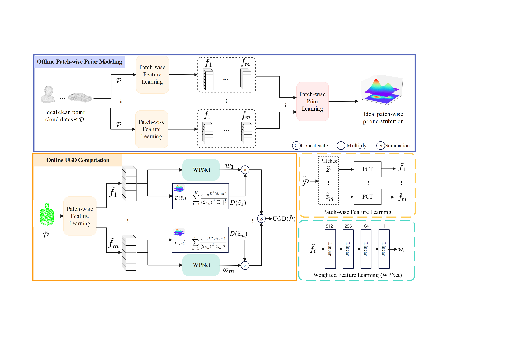
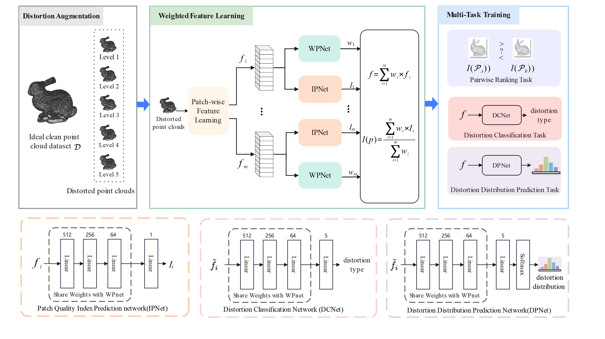

# UGD

Evaluating Real-world Noisy Point Cloud Denoising via An Unsupervised Geometric Metric, named `UGD`, and a high-quality pristine point clouds dataset .   

# Overview

An unsupervised geometric metric via prior learning is proposed, in which a generalized representation is learned from a large collection of high-quality pristine point clouds.




A novel self-supervised approach is proposed, in which pairwise ranking learning is introduced to assist the feature extractor in capturing point cloud noise information.



Our  dataset is released will release soon.


# Run Program

Please copy the `LRL_datasets` dataset in the program same root directory

Self Training feature network:

```she	
python SSTM.py # Self-Training
python ugd.py # UGD Modeling
```

